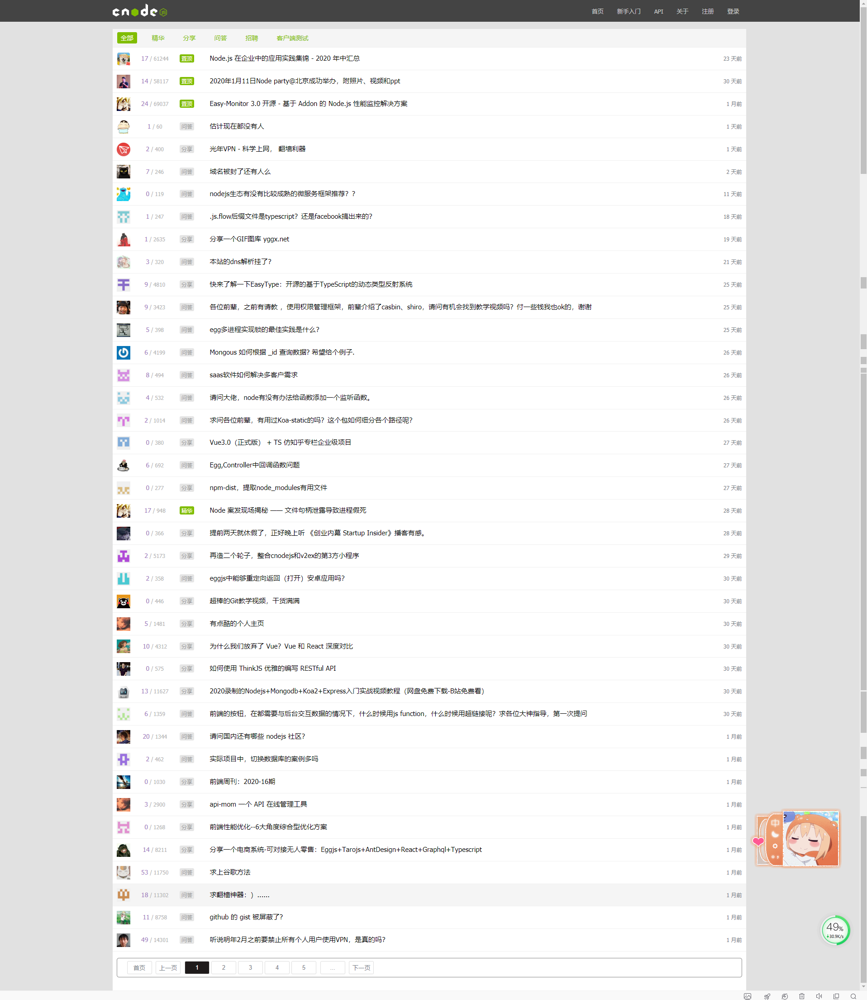
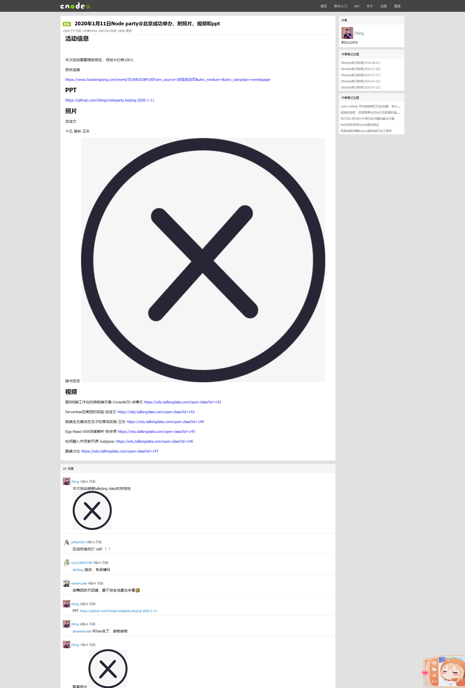
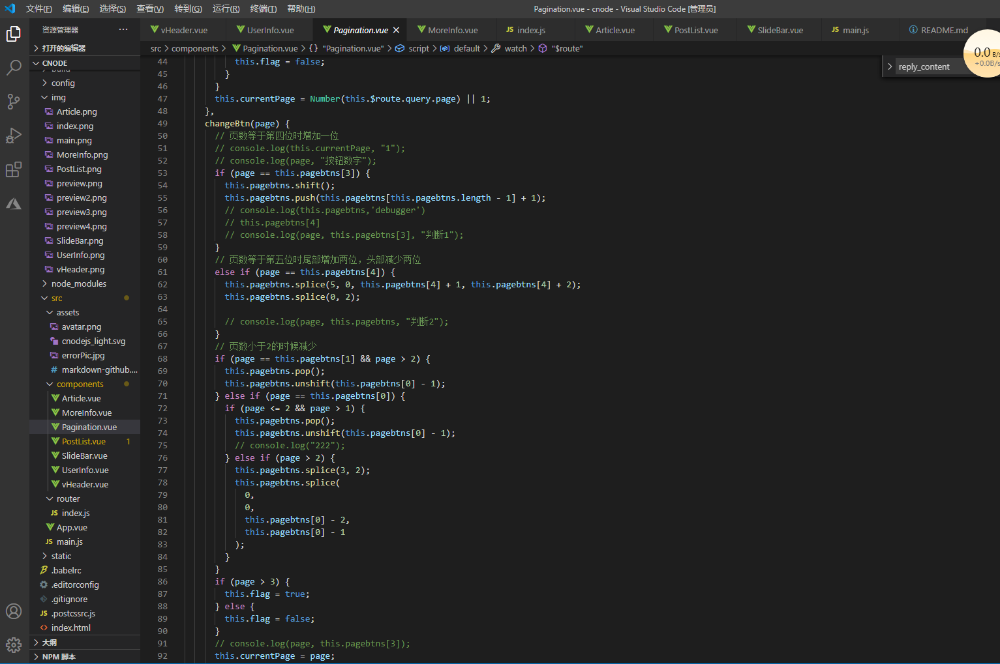
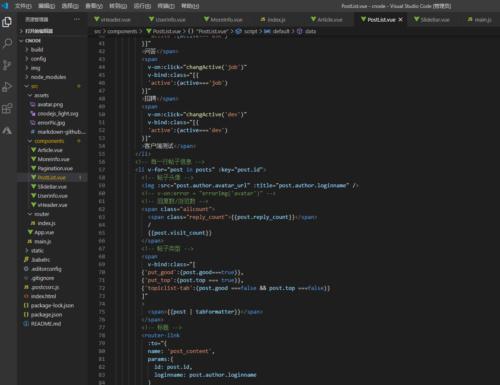

# cnode

> hu
# 预览地址
https://huming3272.github.io/CnodeCommunity/dist/#/

## Build Setup

``` bash
# install dependencies 安装依赖包
npm install

# serve with hot reload at localhost:8080  项目运行的端口
npm run dev

# build for production with minification 
npm run build

# build for production and view the bundle analyzer report
npm run build --report
```

# 组件介绍
主要组件<br/>
vheader是导航,<br/>
postlist是一开始的文章列表,<br/>
pagination通过this.$route.query.page得到页面url参数后更新按钮的页数显示,按钮摁下时还会再更新页面url参数<br/>
sliderBar侧边栏在进入文章页之后会显示<br/>
article 文章详情从pagination组件列表跳转时路由传参携带id进入,得到id然后发送完整请求,返回后得到文章内容<br/>
userInfo 用户信息通过article 文章详情点击头像路由传参携带id进入,然后得到id发送完整请求得到用户详情<br/>
moreInfo 更多用户信息

# 图片预览




